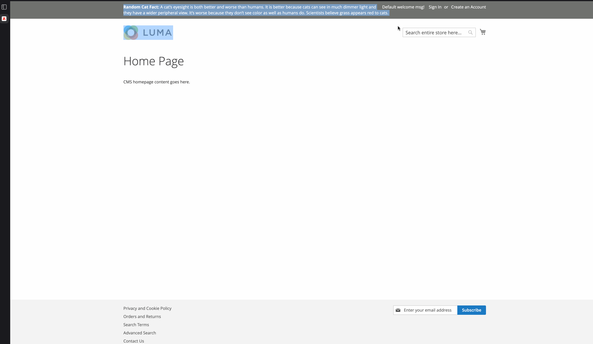

# Overview
F5_CatFacts

Pulls cat facts from public API


# Notes
* Random hands-on module but its production ready, if you have suggestions feel free to open new issue or improve this. 


# install

Add git repo

```
"repositories": [
...
    {
    "type": "git",
    "url": "https://github.com/4j4yk/F5_CatFacts.git"
    },
...
]
```

and use composer install

```
composer require F5/CatFacts dev-main
```

# Demo




